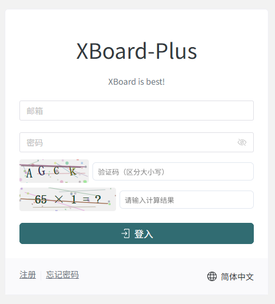
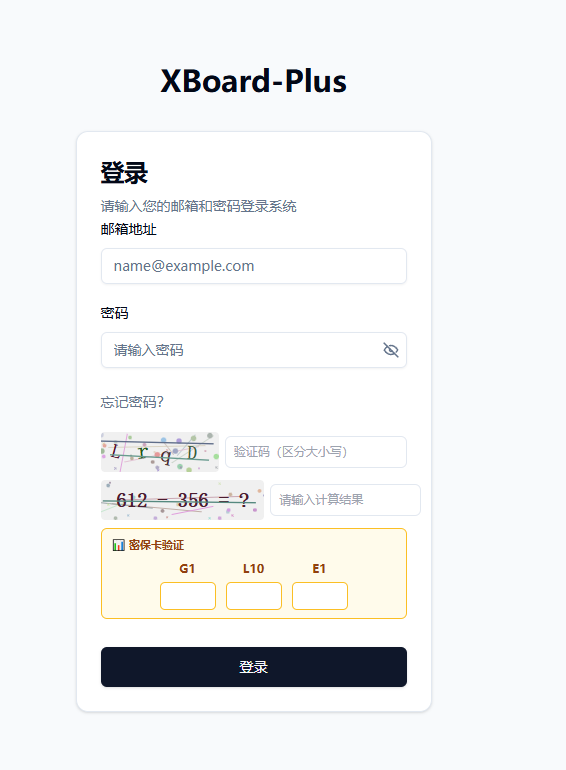
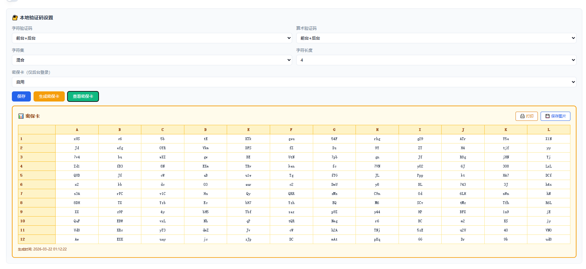
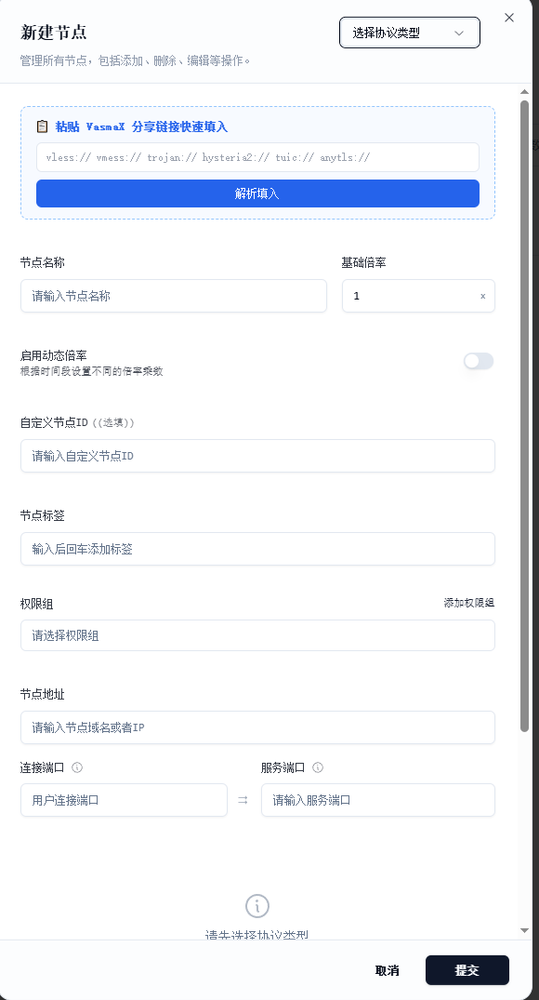
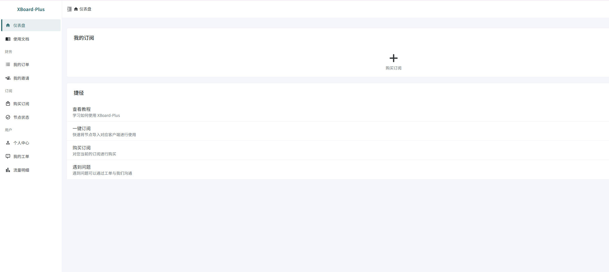
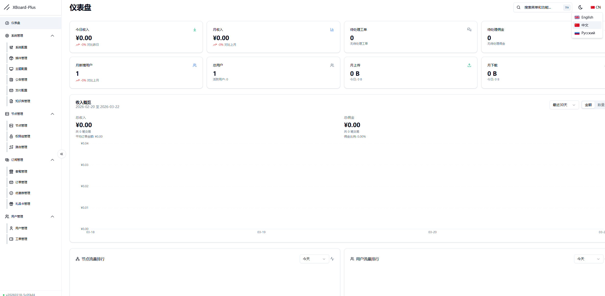
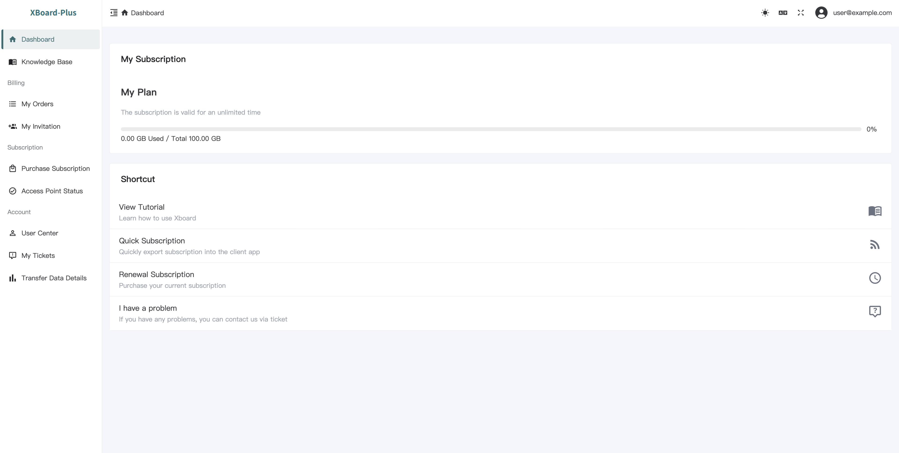
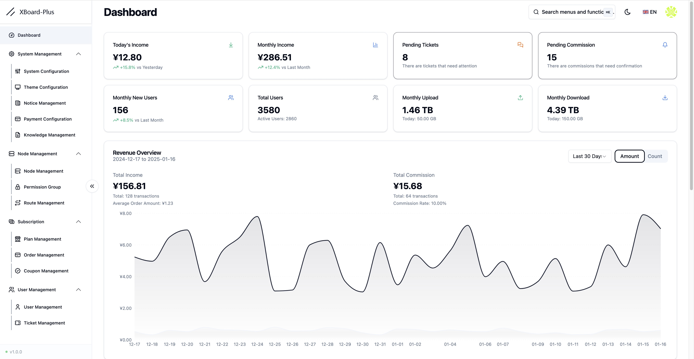

# Xboard-Plus

<div align="center">

[](https://t.me/XboardOfficial)


[](LICENSE)

</div>

## 📖 Introduction

Xboard-Plus is a modern panel system built on Laravel 11, focusing on providing a clean and efficient user experience.

## ✨ Features

- 🚀 Built with Laravel 12 + Octane for significant performance gains
- 🎨 Redesigned admin interface (React + Shadcn UI)
- 📱 Modern user frontend (Vue3 + TypeScript)
- 🐳 Ready-to-use Docker deployment solution
- 🎯 Optimized system architecture for better maintainability

## 🚀 Quick Start

```bash
git clone -b compose --depth 1 https://github.com/cedar2025/Xboard && \
cd Xboard && \
docker compose run -it --rm \
    -e ENABLE_SQLITE=true \
    -e ENABLE_REDIS=true \
    -e ADMIN_ACCOUNT=admin@demo.com \
    web php artisan xboard:install && \
docker compose up -d
```

> After installation, visit: http://SERVER_IP:7001  
> ⚠️ Make sure to save the admin credentials shown during installation

## 🔐 Xboard-Plus 特色功能 / Exclusive Features

Xboard-Plus 在原版 Xboard 基础上增加了多项安全增强与运维便捷功能。
Xboard-Plus builds on the original Xboard with enhanced security features and operational tools designed for production environments.

### 🛡️ 多层验证码系统 / Multi-layer CAPTCHA

支持本地字符验证码（可配置字符集、长度）和算术验证码，可独立控制前台/后台启用，无需依赖第三方服务，有效防御暴力破解和自动化攻击。

Built-in character CAPTCHA (configurable charset: digits, uppercase, lowercase, mixed; adjustable length 4-6 or random) and arithmetic CAPTCHA (addition, subtraction, multiplication, division within 1000). Each type can be independently enabled for frontend, admin, or both — no third-party service required. Includes brute-force protection with per-captcha attempt limits and route-level rate limiting.

| 前台登录 / Frontend Login | 后台登录 / Admin Login |
|:---:|:---:|
|  |  |

### 📊 密保卡系统 / Security Card

后台管理员登录支持密保卡二次验证（12×12 矩阵），每次登录随机抽取坐标验证，支持打印和导出图片，为管理后台提供额外的物理安全层。

Physical two-factor authentication for admin login via a 12×12 security card matrix (columns A-L, rows 1-12, each cell containing a 2-3 character alphanumeric code). On every admin login, 3-4 random coordinates are challenged. Cards can be generated, viewed, printed, and exported as PNG from the admin panel. Provides an offline security layer that cannot be phished or intercepted remotely.



### 📋 一键导入节点 / One-click Node Import

在节点管理对话框中粘贴 VasmaX 分享链接（支持 vless / vmess / trojan / hysteria2 / tuic / anytls），自动解析并填入所有配置字段，大幅提升节点录入效率。

Paste a VasmaX share link directly into the node management dialog to auto-fill all configuration fields. Supports vless, vmess, trojan, hysteria2, tuic, and anytls protocols. Automatically parses transport type, TLS/Reality settings, SNI, path, service name, public key, short ID, fingerprint, obfuscation, and ALPN — eliminating manual entry errors and saving significant time when adding nodes.



### 🔒 安全加固 / Security Hardening

- 验证码暴力破解防护：每个 captchaId 最多 5 次尝试，验证后立即销毁
- 路由级限速：验证码生成 30次/分钟，密保卡挑战 20次/分钟，密保卡验证 10次/分钟
- 场景自动检测：后端根据请求路径判断前台/后台，不信任前端传入的 scene 参数
- 统一错误信息：登录失败不区分"密码错误"和"密保卡错误"，防止信息泄露
- 输入格式验证：captchaId、challengeId 严格正则校验，answers 数量限制

Security measures built into every layer:
- Per-captcha brute-force protection (max 5 attempts per captchaId, one-time use after verification)
- Route-level rate limiting (captcha generation: 30/min, card challenge: 20/min, card verify: 10/min)
- Server-side scene detection based on request path — never trusts frontend-supplied scene parameter
- Unified error messages on login failure to prevent password/card oracle attacks
- Strict input validation with regex on all IDs and length limits on all user inputs

### 🌐 多语言界面 / Multilingual UI

前台和后台均支持中英文界面切换。
Full Chinese and English interface support for both the user frontend and admin panel.

| 中文前台 / CN Frontend | 中文后台 / CN Admin | English Frontend | English Admin |
|:---:|:---:|:---:|:---:|
|  |  |  |  |

---

## 📖 Documentation

### 🔄 Upgrade Notice
> 🚨 **Important:** This version involves significant changes. Please strictly follow the upgrade documentation and backup your database before upgrading. Note that upgrading and migration are different processes, do not confuse them.

### Development Guides
- [Plugin Development Guide](./docs/en/development/plugin-development-guide.md) - Complete guide for developing Xboard-Plus plugins

### Deployment Guides
- [Deploy with 1Panel](./docs/en/installation/1panel.md)
- [Deploy with Docker Compose](./docs/en/installation/docker-compose.md)
- [Deploy with aaPanel](./docs/en/installation/aapanel.md)
- [Deploy with aaPanel + Docker](./docs/en/installation/aapanel-docker.md) (Recommended)

### Migration Guides
- [Migrate from v2board dev](./docs/en/migration/v2board-dev.md)
- [Migrate from v2board 1.7.4](./docs/en/migration/v2board-1.7.4.md)
- [Migrate from v2board 1.7.3](./docs/en/migration/v2board-1.7.3.md)

## 🛠️ Tech Stack

- Backend: Laravel 11 + Octane
- Admin Panel: React + Shadcn UI + TailwindCSS
- User Frontend: Vue3 + TypeScript + NaiveUI
- Deployment: Docker + Docker Compose
- Caching: Redis + Octane Cache

## 📷 Preview

> See [Exclusive Features](#-xboard-plus-特色功能--exclusive-features) section above for full screenshots.

## ⚠️ Disclaimer

This project is for learning and communication purposes only. Users are responsible for any consequences of using this project.

## 🌟 Maintenance Notice

This project is currently under light maintenance. We will:
- Fix critical bugs and security issues
- Review and merge important pull requests
- Provide necessary updates for compatibility

However, new feature development may be limited.

## 🔔 Important Notes

1. Restart required after modifying admin path:
```bash
docker compose restart
```

2. For aaPanel installations, restart the Octane daemon process

## 🤝 Contributing

Issues and Pull Requests are welcome to help improve the project.

## 📈 Star History

[](https://starchart.cc/cedar2025/Xboard)
